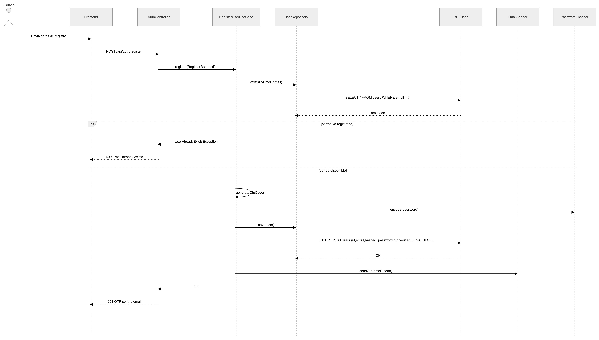
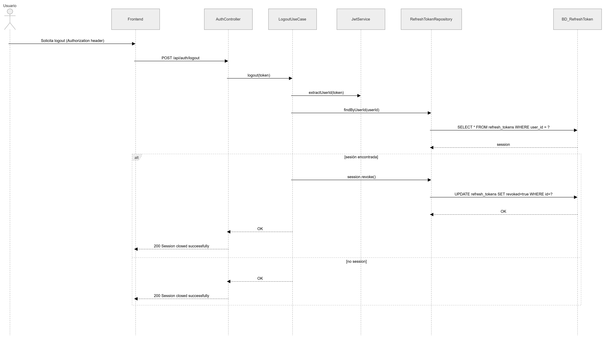
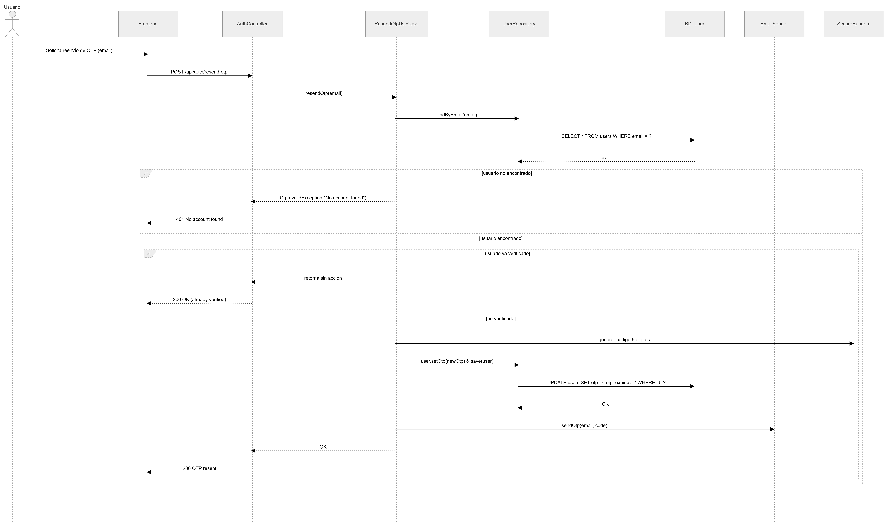
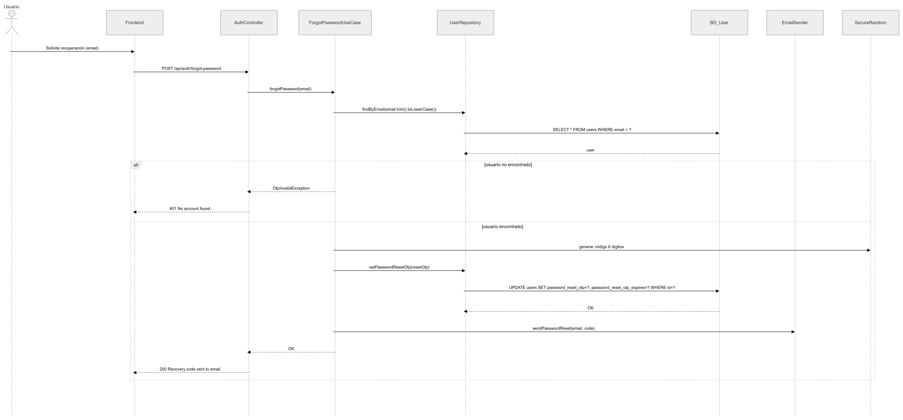

# Auth Service — PATRICIA

Microservicio de autenticación para la plataforma PATRICIA (ECI). Responsable del registro de estudiantes, verificación por OTP, login con JWT y recuperación de contraseña.

---

## Tecnologías

- Java 21 / Spring Boot 4
- Spring Security + JWT
- MongoDB Atlas
- Arquitectura hexagonal (puertos y adaptadores)
- MapStruct, Lombok
- SpringDoc OpenAPI (Swagger UI)
- Docker

---

## Estructura del proyecto

```
src/main/java/.../
├── application/
│   ├── dto/              # Request y response DTOs
│   ├── mapper/           # MapStruct mappers
│   └── usecase/          # Casos de uso (lógica de negocio)
├── domain/
│   ├── exceptions/       # Excepciones de dominio
│   ├── model/            # Modelos de dominio (User, RefreshToken)
│   ├── ports/
│   │   ├── in/           # Puertos de entrada (interfaces de casos de uso)
│   │   └── out/          # Puertos de salida (repositorios, email)
│   └── valueobjects/     # Objetos de valor (Email, Password, OtpEmbedded...)
├── entrypoints/
│   ├── advice/           # Manejador global de excepciones
│   └── rest/             # Controladores REST y mappers de entrada
└── infrastructure/
    ├── adapters/          # Adaptadores de persistencia (MongoDB)
    ├── config/            # Configuración de seguridad
    └── external/          # JWT Service, Email Sender
```

---

## Endpoints — `POST /api/v1/auth/`

| Endpoint         | Descripción                                                  | Auth |
|------------------|--------------------------------------------------------------|------|
| `/register`      | Registra usuario y envía OTP al correo institucional         | No   |
| `/verify-otp`    | Valida OTP y activa la cuenta — retorna tokens JWT           | No   |
| `/resend-otp`    | Reenvía un nuevo OTP (útil si expiró o se agotaron intentos) | No   |
| `/login`         | Autentica y retorna access token + refresh token             | No   |
| `/refresh`       | Rota el refresh token y emite nuevos tokens                  | No   |
| `/logout`        | Revoca el refresh token de la sesión actual                  | Sí   |
| `/forgot-password` | Envía código de recuperación al correo                     | No   |
| `/reset-password`  | Valida código y establece nueva contraseña                 | No   |

La documentación completa con ejemplos está disponible en **Swagger UI**: `http://localhost:8080/swagger-ui.html`


- Diagramas de Secuencia
Un diagrama de secuencia es un tipo de diagrama UML que muestra, en orden temporal, cómo interactúan los actores y los componentes del sistema mediante mensajes o llamadas.

Es importante porque permite entender el comportamiento dinámico de cada funcionalidad, validar los flujos antes de implementar, detectar errores de lógica y comunicar claramente cómo se procesa cada solicitud de extremo a extremo.


- `RegistroDeUsuario.png`

  Muestra el flujo de registro: envío de datos, validación de correo, creación del usuario y envío del OTP.

    

- `ValidacionDeOTP.png`

  Describe la validación del código OTP, la activación de la cuenta y la generación de tokens.

    

- `InicioDeSesion.png`

  Representa el inicio de sesión con validación de credenciales y emisión de access token y refresh token.

    

- `CerrarSesion.png`

  Explica el cierre de sesión mediante la revocación del refresh token activo.

    

- `RenovacionDeToken.png`

  Ilustra la renovación de sesión usando un refresh token válido para emitir nuevos tokens.

    

- `ReenviarOTP.png`

  Muestra el proceso para generar y reenviar un nuevo OTP cuando el anterior no es usable.

    

- `RecuperarContraseña.png`

  Describe la solicitud de recuperación de contraseña y el envío del código de recuperación al correo.

    

- `ResetearContraseña.png`

  Representa la validación del código de recuperación y la actualización final de la contraseña.

    


---

## Flujo de registro

```
1. POST /register     → valida dominio @mail.escuelaing.edu.co
                      → hashea contraseña con BCrypt
                      → genera OTP de 6 dígitos (SecureRandom, backend)
                      → envía OTP al correo institucional
                      → cuenta queda en estado no verificado

2. POST /verify-otp   → valida formato (6 dígitos numéricos)
                      → verifica que no haya expirado (TTL 10 min)
                      → verifica que no se haya usado ya
                      → verifica el código (máx. 3 intentos)
                      → activa la cuenta y retorna tokens JWT

3. POST /resend-otp   → si el OTP expiró o se agotaron los 3 intentos
                      → genera nuevo OTP y resetea el contador
```

---

## Seguridad

- Contraseñas almacenadas con **BCrypt** — nunca en texto plano
- **Este servicio debe ejecutarse sobre HTTPS** en producción — la contraseña viaja en el body de la petición
- El OTP es generado por el **backend** (`SecureRandom`) — el frontend nunca lo genera
- OTP expira en **10 minutos** y se bloquea tras **3 intentos fallidos**
- Login bloqueado **30 minutos** tras 5 intentos fallidos consecutivos
- Tokens: access token de corta duración + refresh token rotativo de 7 días
- Logout revoca el refresh token (el access token expira naturalmente)

---

## Visibilidad de perfil (`ProfileVisibility`)

| Valor         | Quién puede ver el perfil                                         |
|---------------|-------------------------------------------------------------------|
| `PUBLIC`      | Todos los usuarios — aparece en búsqueda y feed                   |
| `PRIVATE`     | Solo el propio usuario                                            |
| `MATCH_ONLY`  | Solo usuarios con afinidad calculada — oculto en búsqueda y feed |

---

## Validaciones de registro

| Campo              | Regla                                                     |
|--------------------|-----------------------------------------------------------|
| `email`            | Obligatorio — debe terminar en `@mail.escuelaing.edu.co`  |
| `password`         | Obligatorio — mínimo 8 caracteres                         |
| `name` / `lastName`| Obligatorios                                              |
| `program`          | Obligatorio                                               |
| `semester`         | Obligatorio — entre 1 y 10                                |
| `interests`        | Obligatorio — mínimo 3 valores del enum `Interes`         |
| `birthDate`        | Obligatorio — debe ser fecha pasada                       |
| `gender`           | Obligatorio — enum `Genero` (MALE, FEMALE, OTHER)         |
| `profileVisibility`| Obligatorio — enum `ProfileVisibility`                    |

> La validación de confirmación de contraseña se realiza **solo en el frontend**. La API recibe únicamente `password`.

---

## Diagrama de componentes

<!-- Insertar aquí el diagrama de componentes del microservicio -->

---

## Diagrama de clases

<!-- Insertar aquí el diagrama de clases (User, OtpEmbedded, RefreshToken, enums) -->

---

## Diagrama de base de datos

<!-- Insertar aquí el diagrama de la colección MongoDB (users, refresh_tokens) -->

---

## Ejecutar localmente

```bash
# Con Docker Compose (incluye MongoDB local)
docker-compose up --build

# Solo el servicio (requiere MongoDB Atlas configurado en application-dev.yml)
mvn spring-boot:run -Pdev
```

Variables de entorno requeridas (ver `application.yml`):

```
MONGODB_URI=<connection string de MongoDB Atlas>
JWT_SECRET=<clave secreta para firmar tokens>
MAIL_USERNAME=<correo remitente>
MAIL_PASSWORD=<contraseña del correo>
```

---

## Tests

```bash
mvn test
```

Cobertura actual: **148 tests** — 0 fallos

Incluye pruebas unitarias para:
- Casos de uso (registro, OTP, login, refresh, logout, recuperación de contraseña, reenvío de OTP)
- Modelos de dominio y value objects
- Controladores REST (escenarios exitosos y de error)
- JWT Service
- Manejador global de excepciones
